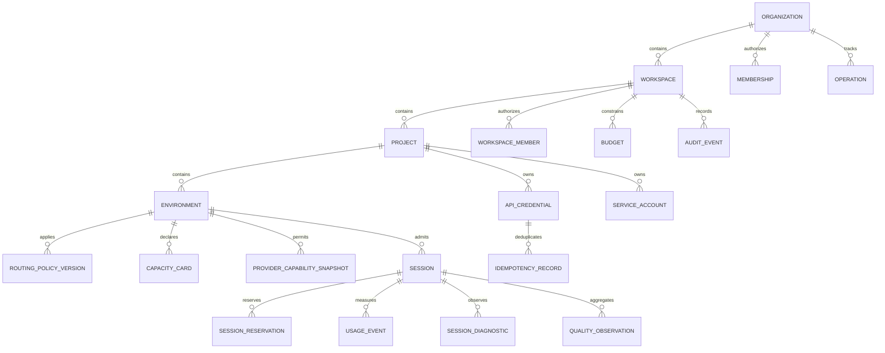

# QingYin 数据模型、ERD 与字段字典

版本：v0.2
状态：实现前数据基线
关联：模块 05、16、17、19、21、22、23；三份 OpenAPI/AsyncAPI 契约

## 1. 目标与不可变规则

本文件将控制面、租户边界、用量、诊断和运营异步任务收敛为可实现的数据模型。它不保存实时原始音频，也不把 Provider 的原始凭证或未脱敏文本写入常规业务表。

- 所有租户业务资源都有 `organization_id`；所有工作空间内资源同时有 `workspace_id`。查询、更新、删除必须先带这两个条件，不能仅以资源 ID 过滤。
- `Organization -> Workspace -> Project -> Environment` 是唯一资源归属链；API Key、服务账号、策略、容量卡、会话、用量、质量和审计都向上可追溯。
- `workspace_id` 不能通过客户端传入的任意 metadata 覆盖；它只能由认证上下文和资源归属推导。
- 控制面采用强一致事务；实时会话热状态采用带 TTL 的短暂状态；诊断明细和受控留存采用对象存储，不让对象存储决定授权。
- 所有金额、配额、计量和审计记录均为追加式或版本化记录，不做无痕覆盖。

## 2. 核心 ERD

关系图表达归属和授权，不表达跨表直接读取权限。所有从属实体的写入均由服务端验证其完整归属链。

## 3. 强一致控制面实体

| 实体 | 主键与必需归属 | 关键字段 | 一致性与约束 |
| --- | --- | --- | --- |
| `organization` | `organization_id` | `name`、`status`、`plan`、`created_at_ms` | `name` 仅展示，可重名；组织停用阻止新会话 |
| `workspace` | `workspace_id`、`organization_id` | `name`、`slug`、`status`、`data_residency` | `UNIQUE(organization_id, slug)`；生命周期遵循模块 22 |
| `project` | `project_id`、`organization_id`、`workspace_id` | `name`、`status` | `UNIQUE(workspace_id, name)`；冻结空间不可新增 |
| `environment` | `environment_id`、完整归属链 | `name`、`kind`、`region`、`status` | `UNIQUE(project_id, name)`；密钥、策略、容量均绑定环境 |
| `membership` / `workspace_member` | 成员 ID、组织或空间 ID | `principal_id`、`role`、`status` | 不允许跨组织主体借由 workspace 获权；角色变更写审计 |
| `api_credential` | `credential_id`、完整归属链 | `key_prefix`、`secret_hash`、`scopes`、`status`、`expires_at_ms` | 只存 hash、加密包络引用和前缀；明文仅创建时返回一次 |
| `service_account` | `service_account_id`、完整归属链 | `name`、`scopes`、`status` | 不可直接成为人类登录身份；凭证独立轮换 |
| `routing_policy_version` | `policy_version_id`、完整归属链 | `policy_id`、`version`、`status`、`rules_json`、`effective_at_ms` | `UNIQUE(environment_id, policy_id, version)`；发布不可覆盖，仅新版本/回滚引用 |
| `provider_capability_snapshot` | `snapshot_id`、环境 ID | `provider_id`、`adapter_version`、`probe_result`、`captured_at_ms`、`expires_at_ms` | 仅 `passed` 且未过期的快照可参加默认路由 |
| `capacity_card` | `card_id`、环境 ID | `resource_fingerprint`、`limits_json`、`tested_p95_ms`、`status` | 规格、压测配置或 Provider quota 改变即失效；不允许用草稿卡提升限额 |
| `budget` | `budget_id`、组织/空间/项目/环境其中之一 | `scope_type`、`period`、`hard_limit`、`soft_limit`、`status` | 同 scope/period 必须可解析出唯一有效预算；硬限额优先于路由偏好 |
| `operation` | `operation_id`、`organization_id` | `type`、`status`、`actor_id`、`request_digest`、`result_ref`、`error` | 异步管理动作可轮询；状态转移单调且审计不可缺失 |
| `idempotency_record` | `credential_id`、`operation_name`、`idempotency_key` | `request_digest`、`response_ref`、`expires_at_ms` | `UNIQUE(credential_id, operation_name, idempotency_key)`；摘要不同返回冲突 |

## 4. 会话、准入与计量实体

| 实体 | 主键与必需归属 | 关键字段 | 写入规则 |
| --- | --- | --- | --- |
| `session` | `session_id`、完整归属链 | `task`、`mode`、`transport_mode`、`status`、`trace_id`、`route_snapshot_id`、`created_at_ms`、`terminal_reason` | 会话状态按模块 01 单调推进；不保存原始音频和完整文本 |
| `session_reservation` | `reservation_id`、`session_id`、完整归属链 | `dimension`、`reserved_amount`、`consumed_amount`、`released_at_ms` | 创建会话与预算预留在同一事务；终态会话必须释放或结算 |
| `usage_event` | `usage_event_id`、`session_id`、完整归属链 | `event_type`、`occurred_at_ms`、`unit`、`quantity`、`provider_cost_ref`、`dedupe_key` | 追加写入；`UNIQUE(dedupe_key)`；允许生成冲正事件，不改历史事件 |
| `usage_aggregate` | 时间分区 + 完整归属链 + 维度 | `task`、`provider_id`、`transport_mode`、`quantity`、`estimated_cost` | 由 usage event 幂等聚合；仅用于查询，不是账务唯一来源 |
| `route_snapshot` | `route_snapshot_id`、完整归属链 | `policy_version_id`、`capability_snapshot_id`、`candidate_digest`、`selected_route` | 会话创建时固化，方便审计和回放决策；不含厂商密钥 |

`session` 的状态变更、`session_reservation` 的释放/结算、终态 `usage_event` 的写入必须以 Outbox 方式提交：同一数据库事务内写领域状态和 outbox，后台消费者幂等投递指标、账务聚合和告警。实时音频帧不进入该 Outbox。

## 5. 诊断、质量与审计实体

| 实体 | 主键与必需归属 | 关键字段 | 隐私与留存 |
| --- | --- | --- | --- |
| `session_diagnostic` | `diagnostic_id`、`session_id`、完整归属链 | `detail_level`、`timeline_ref`、`route_summary`、`transport_summary`、`quality_summary` | L1-L3 默认可用；L4-L5 需策略和角色；对象只保存受控引用 |
| `diagnostic_capture_request` | `capture_request_id`、完整归属链 | `scope`、`detail_level`、`approved_by`、`expires_at_ms`、`status` | L5 原始内容留存必须显式审批、最短 TTL、可撤销和审计 |
| `quality_observation` | `observation_id`、完整归属链 | `task`、`provider_id`、`metric_name`、`metric_value`、`sample_weight` | 默认聚合指标；不得把文本/音频作为 metric 标签 |
| `quality_report` | `report_id`、完整归属链 | `window_start_ms`、`window_end_ms`、`gate_outcome`、`metrics_json`、`sample_count` | 从 observation 可重算；样本不足明确标记，不得伪装通过 |
| `audit_event` | `audit_event_id`、`organization_id`、`workspace_id?` | `actor`、`action`、`target_type`、`target_id`、`outcome`、`request_id`、`occurred_at_ms` | 追加、不可变、可导出；敏感字段仅保存掩码和引用 |

## 6. 存储分层、索引与保留期

| 数据层 | 推荐存储 | 数据 | 关键要求 |
| --- | --- | --- | --- |
| 强一致控制面 | PostgreSQL 或兼容关系库 | 组织、空间、项目、环境、凭证元数据、策略版本、会话索引、预算、审计、Outbox | 行级归属条件、外键/逻辑校验、事务、按 `organization_id/workspace_id/time` 建复合索引 |
| 热状态与限流 | Redis 或等价内存 KV | lease、会话连接状态、token bucket、并发计数、幂等短缓存 | 全部有 TTL；key 前缀至少含 `org:{id}:ws:{id}`；不得是唯一账务来源 |
| 大对象与受控诊断 | 加密对象存储 | 聚合诊断时间线、经批准的受控捕获、离线报告 | 对象 key 含组织/空间前缀；以控制面授权和引用状态为准；独立生命周期策略 |
| 可观测平台 | Prometheus/OTel/日志后端 | 指标、trace、结构化日志 | 标签禁放 PII、session 原文、无限基数 ID；原始记录按最短可用期保留 |

高频表按 `occurred_at_ms` 或 `created_at_ms` 月/日分区，实际分区窗口由每环境容量卡和查询基线决定。所有索引至少包含租户过滤前缀，例如 `session(organization_id, workspace_id, created_at_ms DESC)` 和 `usage_event(organization_id, workspace_id, occurred_at_ms DESC)`。

## 7. 授权和一致性校验清单

每个 Repository、缓存 key、对象 key、查询和后台任务都必须通过以下检查：

1. 认证主体与 `organization_id` 一致；管理面还必须验证角色。
2. 若资源属于空间，查询条件、缓存前缀和对象前缀均包含同一 `workspace_id`。
3. 环境、项目、空间和组织链完整匹配，不能仅验证其中一个 ID。
4. 写入在事务内记录 audit event 或 outbox；失败时不得出现“实际变更但无审计”。
5. 删除先进入 `pending_delete`，异步清理完成后再转 `deleted`；所有未完成会话须先终止/结算。
6. 备份恢复与导出流程必须同样保留组织、空间边界，并执行恢复演练。

## 8. 实现验收

- 自动化租户隔离测试覆盖直接 ID 猜测、cursor 复用、缓存污染、对象 key 替换、异步任务越权和导出越权。
- 幂等测试证明重复创建 session/workspace 不会重复预留、重复计费或重复发起 Provider 会话。
- 终态会话一致性测试证明预算预留最终会释放或结算，且 usage event 可幂等聚合。
- 诊断权限测试证明 L4/L5 无审批或无权限时不会返回原文、原始音频或敏感 Provider 内容。
- 恢复演练从控制面备份恢复后，租户边界、策略版本、预算和审计链仍可验证。
